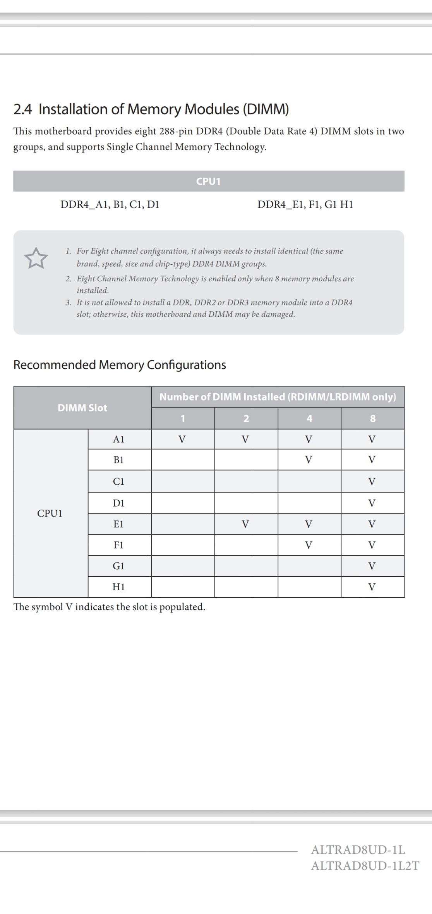
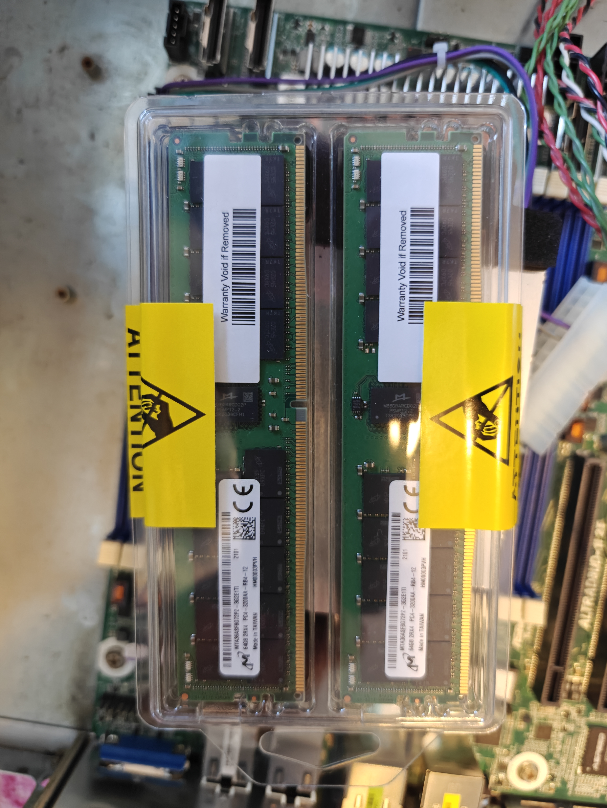

# RAM for the AsrockRack Ampere ALTRAD8UD-1L2T

## Table of Contents
  * [Parts Used](#parts-used)
  * [RAM Placement](#ram)
  * [Installation](#nstallation)

## Parts Used

[Micron 64GB DDR4 3200 8Gx72 ECC CL22 RDIMM Server Memory Module - MTA36ASF8G72PZ-3G2B2](https://www.newegg.com/micron-64gb-288-pin-ddr4-sdram/p/1FR-009G-00004?item=9SIA7S6JP41456&utm_source=transactional&utm_medium=email&cm_mmc=TEMC-Delivery-Notice-USA-_-101932&utm_campaign=TEMC-Delivery-Notice-USA-_-101932)

## RAM Placement

## Installation

  * 
  * 
  * 
