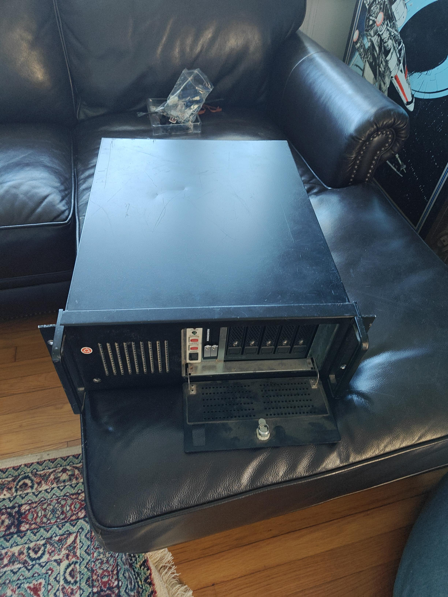
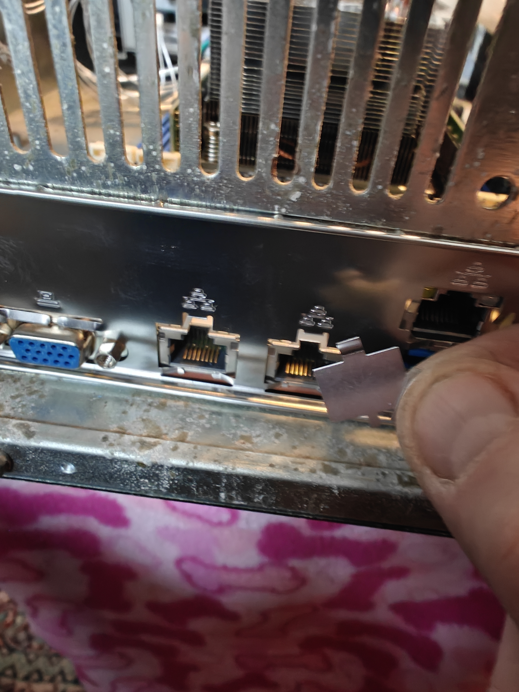

# Case 

A case for the ASRock Rack Ampere ALTRAD8UD-1L2T

## Table of Contents
* [Modifications](#modifications)
  * [Backplate](#backplate)
  * [5.25 Drive Bay](#525-drive-bay)

## Modifications

### Backplate

I realized after starting to plug things in that the network ports were still covered. Rather than pulling everything apart I just moved it back and forth until they both came off.

* 
* 

### 5.25 Drive Bay 

It was necessary to modify the 5.25in drive bay to get the SATA hotswap drive unit to fit.   If you look closely at the picture below, you will notice there are tabs protruding out the inside of the cage.  

The tabs were originall intended to support disks or optical drives that were only a single unit.   The 5 drive enclosure I purchased is 3 5.25 drive units tall and allows for 5x 3.5 sata drives to be mounted.
I used a Dremel to grind down the tabs to allow for easy mounting.  Below are pictures of the finished grinding work.

Dremel work on the right side.

... and the left side of the 5.25 drive cage.

