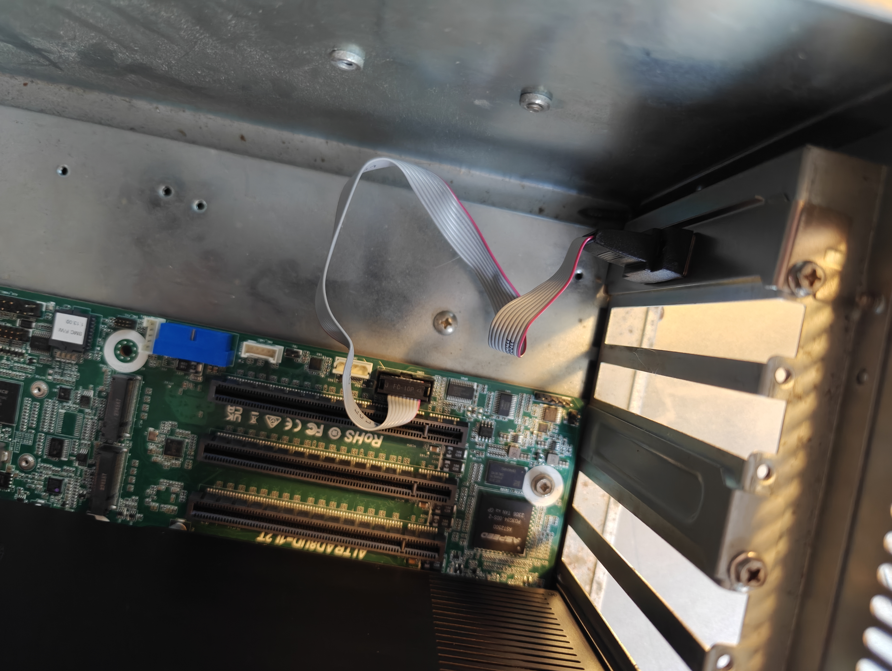
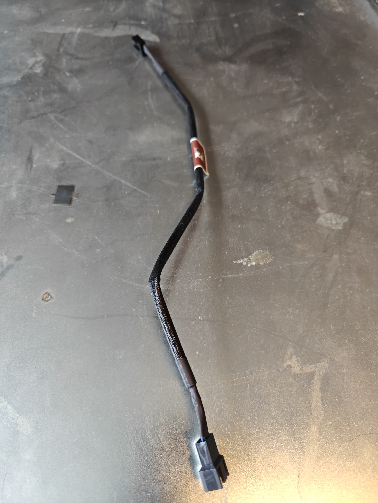
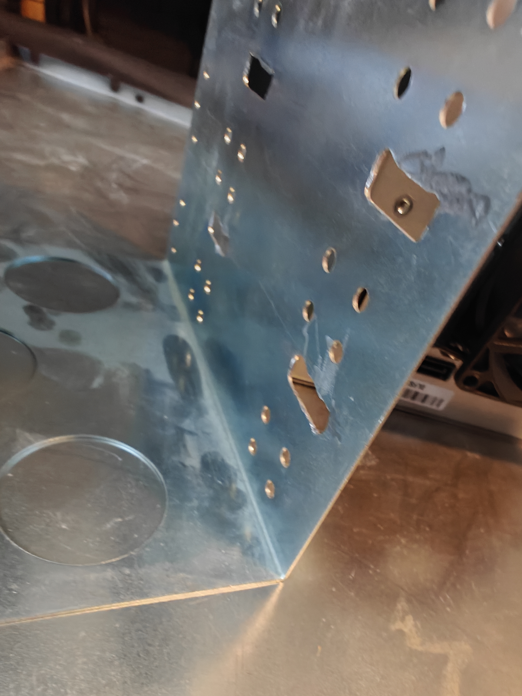

# Case 

A case for the AsrockRack Ampere ALTRAD8UD-1L2T

## Table of Contents
* [PC Speaker](#pc-speaker)
* [USB Ports](#usb-ports)
* [RS323 Ports](#rs232-port)
* [Power and Cooling](#power-and-cooling)
  * [80mm Fans](#80mm-fans)
  * [120mm Fans](#120mm-fans)
  * [Power Supply](#power-supply)
* [Modifications](#modifications)
  * [Backplate](#backplate)
  * [5.25 Drive Bay](#5.25-drive-bay)

## PC Speaker

* [2-Pack PC Motherboard Internal Speaker Mini Plug Speaker Desktop Computer Case DIY Internal BIOS Beep Alarm Buzzer](https://www.amazon.com/gp/product/B0BKG3YB3X/ref=ppx_yo_dt_b_asin_title_o01_s00?ie=UTF8&psc=1)
  * 
  * 
  * 

## USB Ports

* [RIITOP 2 Ports USB 3.0 Female Back Panel to MB 20pin Header Connector Cable Adapter with PCI Slot Plate Bracket 1.5ft](https://www.amazon.com/gp/product/B01KJPUI5W/ref=ppx_yo_dt_b_asin_title_o06_s00?ie=UTF8&th=1)
  * 
  * 
  * 

## RS232 Port

* [axGear Motherboard DB9 RS232 Com Port Serial Header Connector Cable Bracket](https://www.amazon.com/dp/B072BBM6VP?ref=ppx_yo2ov_dt_b_fed_asin_title)
  * 
  * 
<!--  *  -->
  * 

## Power and Cooling

### 80mm Fans
* [Noctua NF-A8 PWM, Premium Quiet Fan, 4-Pin (80mm, Brown)](https://www.amazon.com/gp/product/B00NEMG62M/ref=ppx_yo_dt_b_asin_title_o03_s00?ie=UTF8&th=1)
  * 
  <!-- *  -->
  <!-- *  -->
  * 
  * 
  * 
  * 
  * 

### 120mm Fans
* [Noctua NF-A12x25 PWM, Premium Quiet Fan, 4-Pin (120mm, Brown)](https://www.amazon.com/gp/product/B07C5VG64V/ref=ppx_yo_dt_b_asin_title_o03_s00?ie=UTF8&psc=1)

### Power Supply
* [Corsair HX1000i Fully Modular Ultra-Low Noise ATX Power Supply - ATX 3.0 & PCIe 5.0 Compliant - Fluid Dynamic Bearing Fan - CORSAIR iCUE Software Compatible - 80 Plus Platinum Efficiency - Black](https://amazon.com/dp/B0BZ2CRW8H?ref=ppx_yo2ov_dt_b_fed_asin_title&th=1)

## Modifications

### Backplate

I realized after starting to plug things in that the network ports were still covered. Rather than pulling everything apart I just moved it back and forth until they both came off.

* 

### 5.25 Drive Bay 

It was necessary to modify the 5.25in drive bay to get the SATA hotswap drive unit to fit.   If you look closely at the picture below, you will notice there are tabs protruding out the inside of the cage.  

The tabs were originall intended to support disks or optical drives that were only a single unit.   The 5 drive enclosure I purchased is 3 5.25 drive units tall and allows for 5x 3.5 sata drives to be mounted.
I used a Dremel to grind down the tabs to allow for easy mounting.  Below are pictures of the finished grinding work.

Dremel work on the right side.

... and the left side of the 5.25 drive cage.

