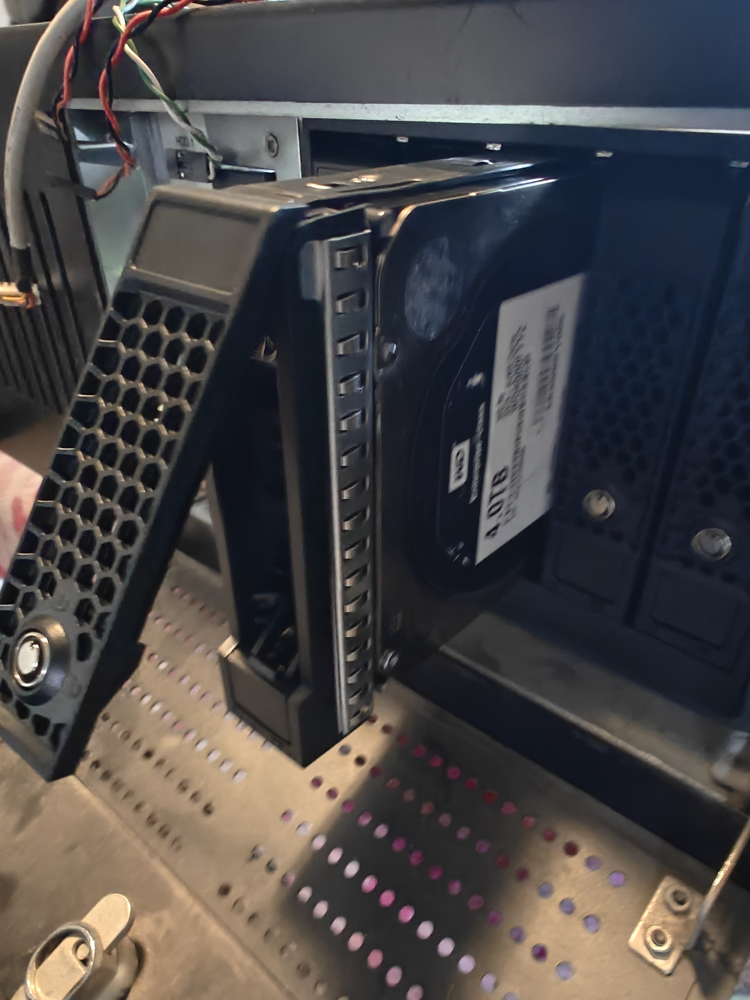
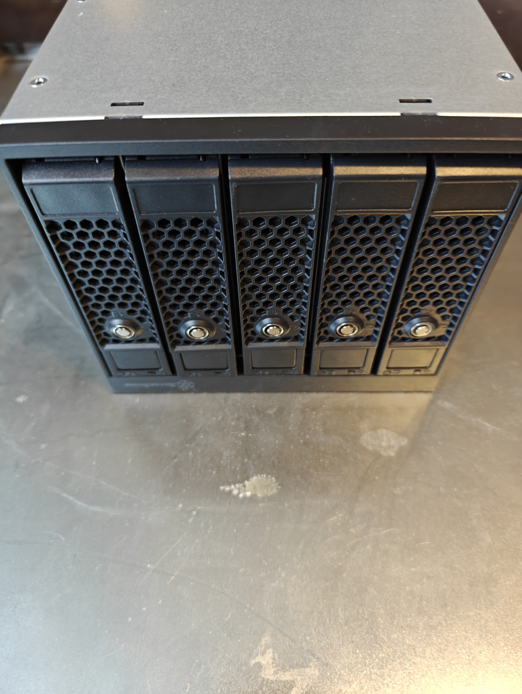
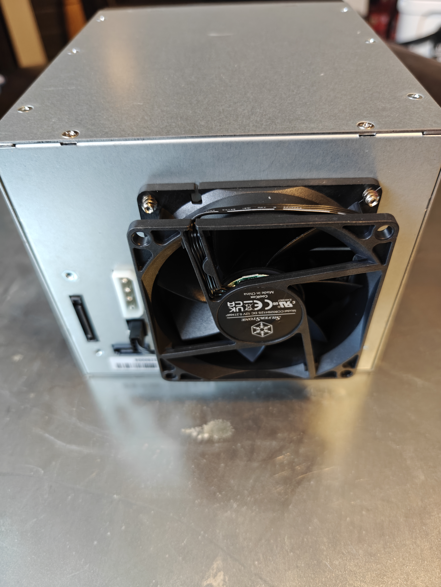
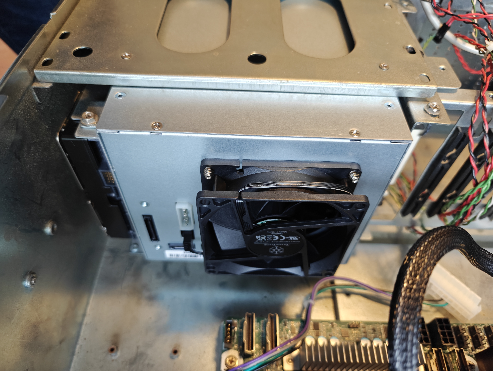

# AsrockRack Ampere ALTRAD8UD-1L2T

## Table of Contents
* [Sata Drives](#sata-drives)
  * [Parts](#parts)
* [Sata Hotswap Enclosure](#sata-hotswap-enclosure)
  * [Parts](#parts)

## SATA Drives

### Parts

* [Western Digital WD4000FYYZ ENTERPRISE 4TB 7200RPM 64MB Cache SATA 6.0Gb/s 3.5 internal hard drive](https://www.amazon.com/Western-Digital-WD4000FYYZ-ENTERPRISE-internal/dp/B00CVT9UH2/ref=sr_1_3?crid=27PI74WQQZOCI&dib=eyJ2IjoiMSJ9.ogxAhN4wR1NH4UnfQJC84Xj1p62sw3-QWS49RqSMCMWYDnZYBB98c5kf-7p4nUg9CxtWxNuvko8tc17ekqBsh6db4SYKuwhwV1TtwDrFXQW1T5EiQK7GBkt0VXv3dzGcY-go_gIA2fEBMtXugrw8hkqksqCzJcYTtNW0M7Zm2BjpFVNHm0MpLp7BK6wskZaYqcee4icygOe97_XENR6v1I32Nx2Sbv2vxUch5MABV1Y.gn76R_ivLkIQ3L657GsVfVMEO3geysKosclT3NzgsAU&dib_tag=se&keywords=wd4000fyyz%2B4tb&qid=1733937411&sprefix=WD4000FYYZ%2Caps%2C140&sr=8-3&th=1)

## Sata HotSwap Enclosure
### Parts
* [SilverStone Technology FS305-E Three 5.25" Device Bay to Five 3.5" SAS-12G / SATA 6Gbit/s Hot-swap Adapter Cage, SST-FS305-E](https://www.amazon.com/dp/B0BR8PSJ9V?ref=ppx_yo2ov_dt_b_fed_asin_title)

### Installation

* 
* 
* 
* 
* 
* 
* 
* 
* 
* 
