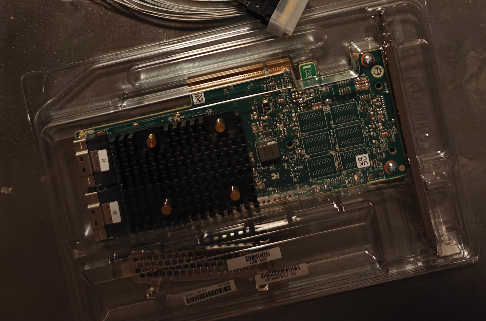
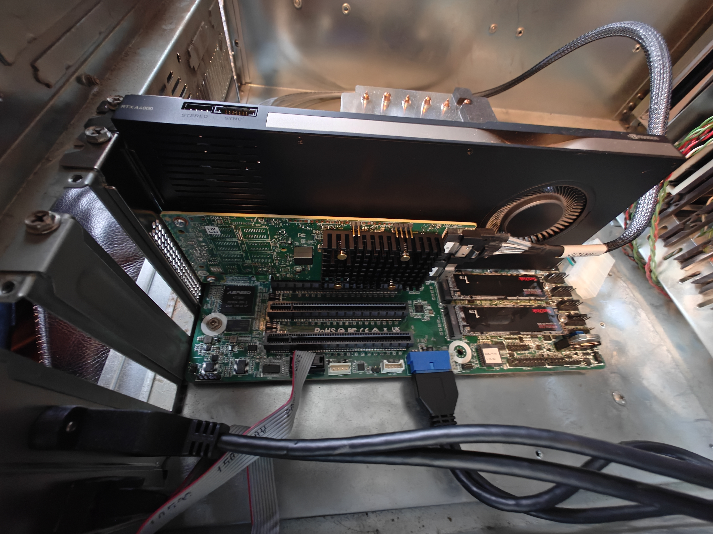

# AsrockRack Ampere ALTRAD8UD-1L2T

## Table of Contents
* [Storage](#storage)
  * [NVME](nvme.md)
  * [Storage Cables](#storage-cables)
  * [Sata HBA](#sata-hba)
  * [Sata Drives](sata_hotswap.md#sata-drives)
  * [Sata Hotswap Enclosure](sata_hotswap.md#sata-hostswap-enclosure)

## Storage

### [NVME](nvme.md)

### Storage Cables

#### slimsas to sata

* [𝐃𝐢𝐋𝐢𝐧𝐤𝐞𝐫 𝐒𝐥𝐢𝐦𝐒𝐀𝐒 X8 to 8*𝐒𝐀𝐓𝐀,𝐒𝐅𝐅-𝟖𝟔𝟓𝟒 74P to 8*𝐒𝐀𝐓𝐀 7P, SlimSAS Host/RAID to SATA Target HD, 85CM Cable](https://www.amazon.com/dp/B09S3NKZNZ?ref=ppx_yo2ov_dt_b_fed_asin_title)

* 

#### SlimSAS to U2 NVME

* [𝐃𝐢𝐋𝐢𝐧𝐤𝐞𝐫 𝐒𝐥𝐢𝐦𝐒𝐀𝐒 8X to 2*𝐔.𝟐 𝐍𝐕𝐌𝐞 Adapter,𝐒𝐅𝐅-𝟖𝟔𝟓𝟒 74pin to 2*𝐒𝐅𝐅-𝟖𝟔𝟑𝟗 68pin Cable with Power, 75CM(Broadcom MPN 05-60005-00，CBL-SAST-0953)](https://www.amazon.com/dp/B098JBS7QD?ref=ppx_yo2ov_dt_b_fed_asin_title)

### SATA HBA

* [9500-16i 12Gb/s HBA TriMode SAS/NVMe](https://www.amazon.com/dp/B08926P9R4?ref=ppx_yo2ov_dt_b_fed_asin_title)
* 

#### Installation
  * 
  * 
  * 
  * 
  * 
