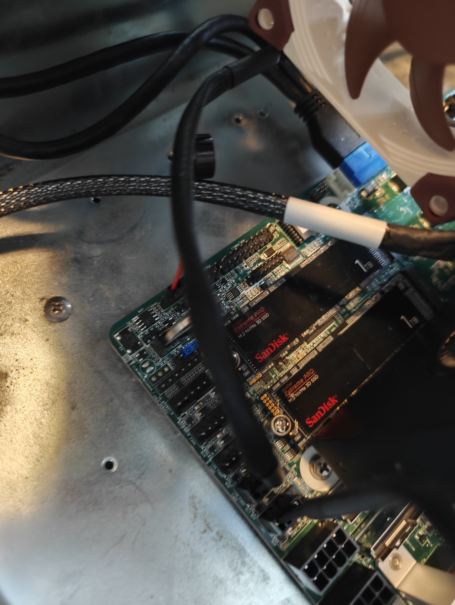
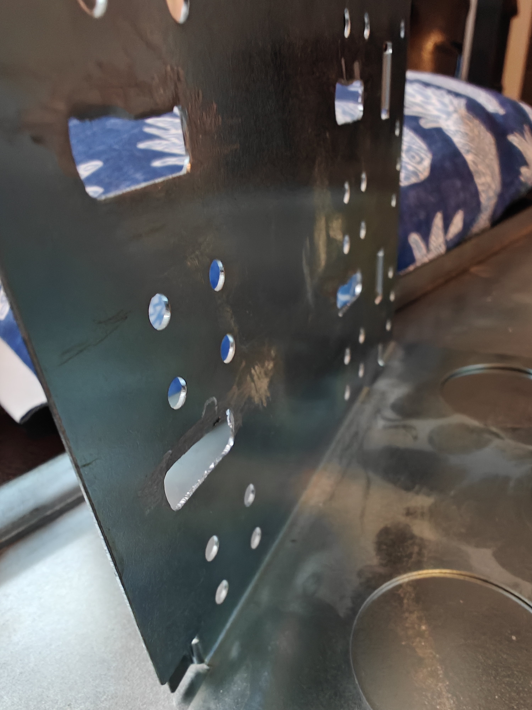

# AsrockRack Ampere ALTRAD8UD-1L2T

## Table of Contents
* [Storage](#storage)
  * [NVME](#nvme)
  * [Storage Cables](#storage-cables)
  * [Sata HBA](#sata-hba)
  * [Sata Drives](#sata-drives)
  * [Sata Hotswap Enclosure](#sata-hotswap-enclosure)

## Storage

### NVME
* [SAMSUNG 970 EVO Plus SSD 1TB NVMe M.2 Internal Solid State Hard Drive, V-NAND Technology, Storage and Memory Expansion for Gaming, Graphics w/Heat Control, Max Speed, MZ-V7S1T0B/AM](https://www.amazon.com/gp/product/B07MFZY2F2/ref=ppx_yo_dt_b_asin_title_o02_s00?ie=UTF8&th=1)
  * 
  * 

### Storage Cables

* [𝐃𝐢𝐋𝐢𝐧𝐤𝐞𝐫 𝐒𝐥𝐢𝐦𝐒𝐀𝐒 X8 to 8*𝐒𝐀𝐓𝐀,𝐒𝐅𝐅-𝟖𝟔𝟓𝟒 74P to 8*𝐒𝐀𝐓𝐀 7P, SlimSAS Host/RAID to SATA Target HD, 85CM Cable](https://www.amazon.com/dp/B09S3NKZNZ?ref=ppx_yo2ov_dt_b_fed_asin_title)
* [𝐃𝐢𝐋𝐢𝐧𝐤𝐞𝐫 𝐒𝐥𝐢𝐦𝐒𝐀𝐒 8X to 2*𝐔.𝟐 𝐍𝐕𝐌𝐞 Adapter,𝐒𝐅𝐅-𝟖𝟔𝟓𝟒 74pin to 2*𝐒𝐅𝐅-𝟖𝟔𝟑𝟗 68pin Cable with Power, 75CM(Broadcom MPN 05-60005-00，CBL-SAST-0953)](https://www.amazon.com/dp/B098JBS7QD?ref=ppx_yo2ov_dt_b_fed_asin_title)

### SATA HBA
* [9500-16i 12Gb/s HBA TriMode SAS/NVMe](https://www.amazon.com/dp/B08926P9R4?ref=ppx_yo2ov_dt_b_fed_asin_title)
  * 
  * 
  * 
  * 
  * 
  * 
  * 

### SATA Drives
* [Western Digital WD4000FYYZ ENTERPRISE 4TB 7200RPM 64MB Cache SATA 6.0Gb/s 3.5 internal hard drive](https://www.amazon.com/Western-Digital-WD4000FYYZ-ENTERPRISE-internal/dp/B00CVT9UH2/ref=sr_1_3?crid=27PI74WQQZOCI&dib=eyJ2IjoiMSJ9.ogxAhN4wR1NH4UnfQJC84Xj1p62sw3-QWS49RqSMCMWYDnZYBB98c5kf-7p4nUg9CxtWxNuvko8tc17ekqBsh6db4SYKuwhwV1TtwDrFXQW1T5EiQK7GBkt0VXv3dzGcY-go_gIA2fEBMtXugrw8hkqksqCzJcYTtNW0M7Zm2BjpFVNHm0MpLp7BK6wskZaYqcee4icygOe97_XENR6v1I32Nx2Sbv2vxUch5MABV1Y.gn76R_ivLkIQ3L657GsVfVMEO3geysKosclT3NzgsAU&dib_tag=se&keywords=wd4000fyyz%2B4tb&qid=1733937411&sprefix=WD4000FYYZ%2Caps%2C140&sr=8-3&th=1)
  * 
  * 
  * 

### Sata HotSwap Enclosure
* [SilverStone Technology FS305-E Three 5.25" Device Bay to Five 3.5" SAS-12G / SATA 6Gbit/s Hot-swap Adapter Cage, SST-FS305-E](https://www.amazon.com/dp/B0BR8PSJ9V?ref=ppx_yo2ov_dt_b_fed_asin_title)
  * 
  * 
  * 
  * 
  * 
  * 
  * 
  * 
